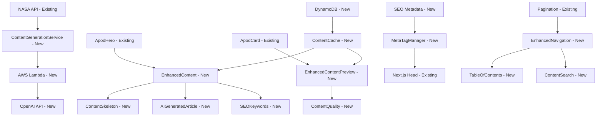

# Infinite - Slovak NASA APOD Website Brownfield Enhancement Architecture

## Introduction

This document outlines the architectural approach for enhancing **Infinite - Slovak NASA APOD Website** with **AI-generated Slovak content and AWS backend services**. Its primary goal is to serve as the guiding architectural blueprint for AI-driven development of new features while ensuring seamless integration with the existing Next.js frontend system.

**Relationship to Existing Architecture:**
This document supplements existing project architecture by defining how new AWS backend components will integrate with the current Next.js frontend. Where conflicts arise between new and existing patterns, this document provides guidance on maintaining consistency while implementing AI content generation enhancements.

### Existing Project Analysis

Based on my analysis of your existing project structure, I've identified the following about your current system:

**Current Project State:**
- **Primary Purpose:** Slovak-language NASA APOD website with minimalist dark design
- **Current Tech Stack:** Next.js 14 (App Router), TypeScript, Tailwind CSS, Radix UI components
- **Architecture Style:** Modern React SPA with server-side rendering and static generation
- **Deployment Method:** **AWS deployment** (Amplify, S3 + CloudFront, or EC2) - to be determined

**Available Documentation:**
- README.md with comprehensive setup and deployment instructions
- Package.json with full dependency list including Radix UI components
- Existing project structure with app/, components/, lib/ directories
- NASA API integration already implemented

**Identified Constraints:**
- Must preserve existing Next.js frontend architecture
- Must maintain current dark theme and responsive design
- Must preserve existing NASA API integration
- **Must deploy entirely on AWS infrastructure**
- Must work within AWS free-tier limits for cost efficiency
- Must use AWS CLI for deployment and management

### Change Log

| Change | Date | Version | Description | Author |
|--------|------|---------|-------------|---------|
| Initial Architecture | 2024-12-19 | 1.0 | Brownfield architecture for AI enhancement | Winston (Architect) |

## Enhancement Scope and Integration Strategy

Based on my analysis of your existing Next.js frontend and the PRD requirements, here's how the AI enhancement will integrate with your current system:

### Enhancement Overview

**Enhancement Type:** AI Content Generation and SEO Optimization
**Scope:** Add AWS backend services for Slovak content generation while preserving existing frontend
**Integration Impact:** Moderate - New backend services with minimal frontend changes

### Integration Approach

**Code Integration Strategy:** 
- Preserve existing Next.js frontend architecture completely
- Add new API routes in `/app/api/` for AWS backend communication
- Extend existing components to display enhanced content progressively
- Maintain existing NASA API integration as fallback

**Database Integration:** 
- No changes to existing frontend data handling
- New DynamoDB tables for AI-generated content storage
- Existing content structure preserved for backward compatibility

**API Integration:** 
- Extend existing NASA API integration with AI processing layer
- New internal APIs for content enhancement and retrieval
- Maintain existing API patterns and error handling

**UI Integration:** 
- Enhance existing components with progressive content loading
- Maintain current dark theme and responsive design
- Add new components for enhanced content display

### Compatibility Requirements

- **Existing API Compatibility:** All current NASA API functionality preserved
- **Database Schema Compatibility:** No changes to existing data structures
- **UI/UX Consistency:** Enhanced content integrates seamlessly with existing design
- **Performance Impact:** Maintains current page load times with progressive enhancement

## Tech Stack Alignment

Based on your existing Next.js frontend and the need for AI content generation, here's how we'll align the technology stack:

### Existing Technology Stack

| Category | Current Technology | Version | Usage in Enhancement | Notes |
|----------|-------------------|---------|---------------------|-------|
| **Frontend Framework** | Next.js | 14.2.25 | Preserved as-is | App Router, SSR, ISR |
| **Language** | TypeScript | ^5 | Extended for new components | Type safety for AI integration |
| **Styling** | Tailwind CSS | ^4.1.9 | Enhanced for new components | Maintains existing design system |
| **UI Components** | Radix UI | Various | Extended with new components | Consistent component library |
| **State Management** | React Hooks | ^19 | Enhanced with new hooks | Local state for enhanced content |
| **API Integration** | Fetch/API Routes | Built-in | Extended with AWS integration | New API routes for backend |
| **Deployment** | Vercel → **AWS Amplify** | - | Migrated to AWS | Unified AWS deployment |
| **Font** | Geist | ^1.3.1 | Preserved | Maintains typography |
| **Date Handling** | date-fns | 4.1.0 | Extended for content management | Enhanced date utilities |

### New Technology Additions

| Technology | Version | Purpose | Rationale | Integration Method |
|------------|---------|---------|-----------|-------------------|
| **AWS Amplify** | Latest | Frontend hosting | Unified AWS deployment | CLI-based deployment |
| **AWS Lambda** | Latest | AI content processing | Serverless AI generation | API Gateway integration |
| **DynamoDB** | Latest | Content storage | NoSQL for flexible schema | AWS SDK integration |
| **S3** | Latest | Image caching | CDN for NASA images | AWS SDK integration |
| **CloudFront** | Latest | Global CDN | Performance optimization | Automatic with Amplify |
| **OpenAI API** | Latest | Slovak content generation | AI text generation | Lambda function integration |
| **AWS CLI** | Latest | Infrastructure management | Consistent deployment | Local development setup |

## Data Models and Schema Changes

Based on your existing NASA APOD integration and the need for AI-enhanced content, here's the data architecture:

### New Data Models

#### APOD Content Model

**Purpose:** Store original NASA APOD data with AI-enhanced Slovak content
**Integration:** Extends existing NASA API data structure

**Key Attributes:**
- `id`: String - Unique identifier (date-based)
- `date`: String - APOD date (YYYY-MM-DD format)
- `originalTitle`: String - Original NASA title
- `originalExplanation`: String - Original NASA explanation
- `imageUrl`: String - Original NASA image URL
- `hdImageUrl`: String - High-resolution image URL
- `mediaType`: String - "image" or "video"
- `copyright`: String - Image copyright information
- `slovakTitle`: String - AI-generated Slovak title
- `slovakArticle`: String - AI-generated Slovak article (500-1000 words)
- `seoKeywords`: Array<String> - AI-generated Slovak keywords
- `contentQuality`: Number - Quality score (0-100)
- `generatedAt`: DateTime - When AI content was generated
- `lastUpdated`: DateTime - Last modification timestamp

**Relationships:**
- **With Existing:** Extends current NASA API data structure
- **With New:** Links to SEO metadata and content validation

#### SEO Metadata Model

**Purpose:** Store AI-generated SEO optimization data
**Integration:** Complements APOD content for search optimization

**Key Attributes:**
- `apodId`: String - Reference to APOD content
- `metaTitle`: String - Optimized page title
- `metaDescription`: String - SEO meta description
- `keywords`: Array<String> - Primary SEO keywords
- `longTailKeywords`: Array<String> - Long-tail keyword variations
- `structuredData`: Object - JSON-LD structured data
- `openGraphData`: Object - Social media optimization
- `generatedAt`: DateTime - SEO generation timestamp

**Relationships:**
- **With Existing:** None (new model)
- **With New:** One-to-one with APOD Content

#### Content Cache Model

**Purpose:** Cache AI-generated content for performance optimization
**Integration:** Supports existing content delivery patterns

**Key Attributes:**
- `cacheKey`: String - Unique cache identifier
- `contentType`: String - "article", "keywords", "seo"
- `contentData`: Object - Cached content data
- `expiresAt`: DateTime - Cache expiration
- `hitCount`: Number - Cache usage statistics
- `createdAt`: DateTime - Cache creation time

**Relationships:**
- **With Existing:** None (new model)
- **With New:** Supports APOD Content and SEO Metadata

### Schema Integration Strategy

**Database Changes Required:**
- **New Tables:** 
  - `apod_content` - Main content storage
  - `seo_metadata` - SEO optimization data
  - `content_cache` - Performance caching
- **Modified Tables:** None (preserving existing structure)
- **New Indexes:** 
  - Date-based queries on `apod_content.date`
  - Content quality filtering on `apod_content.contentQuality`
  - Cache performance on `content_cache.cacheKey`

**Migration Strategy:**
- **Phase 1:** Create new DynamoDB tables
- **Phase 2:** Migrate existing NASA API data to new schema
- **Phase 3:** Implement AI content generation pipeline
- **Phase 4:** Add caching and performance optimization

**Backward Compatibility:**
- **Existing API Compatibility:** All current NASA API endpoints preserved
- **Data Structure Preservation:** Original NASA data structure maintained
- **Fallback Support:** System works with or without enhanced content

## Component Architecture

Based on your existing Next.js frontend structure and the need for AI-enhanced content, here's the component architecture:

### New Components

#### Enhanced Content Display Component

**Responsibility:** Display AI-generated Slovak content alongside original NASA imagery
**Integration Points:** Integrates with existing `ApodHero` and `ApodCard` components

**Key Interfaces:**
- `EnhancedContentProps` - Props for enhanced content display
- `ContentLoadingState` - Loading states for progressive enhancement
- `ContentErrorState` - Error handling for AI content failures

**Dependencies:**
- **Existing Components:** `ApodHero`, `ApodCard`, `Prose` (for typography)
- **New Components:** `ContentSkeleton`, `SEOKeywords`, `ContentQuality`

**Technology Stack:** React 19, TypeScript, Tailwind CSS, Radix UI

#### AI Content Generation Service

**Responsibility:** Handle AI content generation and caching
**Integration Points:** Communicates with AWS Lambda functions via API routes

**Key Interfaces:**
- `ContentGenerationAPI` - API for AI content generation
- `ContentCacheAPI` - Caching and retrieval interface
- `ContentValidationAPI` - Quality validation interface

**Dependencies:**
- **Existing Components:** None (service layer)
- **New Components:** `ContentCache`, `ContentValidator`

**Technology Stack:** AWS Lambda, DynamoDB, OpenAI API

#### SEO Optimization Component

**Responsibility:** Manage AI-generated SEO metadata and keywords
**Integration Points:** Integrates with existing SEO infrastructure

**Key Interfaces:**
- `SEODataProps` - Props for SEO metadata display
- `KeywordDisplayProps` - Props for keyword visualization
- `MetaTagManager` - Dynamic meta tag management

**Dependencies:**
- **Existing Components:** None (SEO infrastructure)
- **New Components:** `KeywordCloud`, `MetaTagGenerator`

**Technology Stack:** Next.js API routes, AWS Lambda, DynamoDB

#### Content Navigation Enhancement

**Responsibility:** Enhanced navigation for longer AI-generated articles
**Integration Points:** Extends existing date-based navigation

**Key Interfaces:**
- `EnhancedNavigationProps` - Props for enhanced navigation
- `ContentTableOfContents` - Table of contents for long articles
- `ContentSearchProps` - Search functionality with AI keywords

**Dependencies:**
- **Existing Components:** `Pagination` (enhanced)
- **New Components:** `TableOfContents`, `ContentSearch`, `ScrollIndicator`

**Technology Stack:** React 19, TypeScript, Tailwind CSS

### Component Interaction Diagram



## API Design and Integration

Based on your existing NASA API integration and the need for AI-enhanced content, here's the API architecture:

### API Integration Strategy

**API Integration Strategy:** RESTful API design with Next.js API routes as the frontend interface
**Authentication:** AWS IAM roles and API keys for service-to-service communication
**Versioning:** Semantic versioning with backward compatibility for existing endpoints

### New API Endpoints

#### Content Generation API

- **Method:** POST
- **Endpoint:** `/api/content/generate`
- **Purpose:** Generate AI-enhanced Slovak content from NASA APOD data
- **Integration:** Extends existing NASA API integration with AI processing

**Request:**
```json
{
  "apodData": {
    "date": "2024-12-19",
    "title": "Original NASA Title",
    "explanation": "Original NASA explanation...",
    "imageUrl": "https://apod.nasa.gov/...",
    "mediaType": "image"
  },
  "options": {
    "contentLength": "medium",
    "targetAudience": "general",
    "includeKeywords": true
  }
}
```

**Response:**
```json
{
  "success": true,
  "data": {
    "id": "2024-12-19",
    "slovakTitle": "Slovenský názov",
    "slovakArticle": "Rozšírený slovenský článok...",
    "seoKeywords": ["astronómia", "vesmír", "NASA"],
    "contentQuality": 95,
    "generatedAt": "2024-12-19T10:30:00Z"
  }
}
```

#### Content Retrieval API

- **Method:** GET
- **Endpoint:** `/api/content/retrieve/{date}`
- **Purpose:** Retrieve AI-enhanced content for specific APOD date
- **Integration:** Complements existing NASA API with enhanced content

**Request:**
```json
{
  "date": "2024-12-19",
  "includeOriginal": true,
  "includeEnhanced": true
}
```

**Response:**
```json
{
  "success": true,
  "data": {
    "original": {
      "title": "Original NASA Title",
      "explanation": "Original explanation...",
      "imageUrl": "https://apod.nasa.gov/..."
    },
    "enhanced": {
      "slovakTitle": "Slovenský názov",
      "slovakArticle": "Rozšírený článok...",
      "seoKeywords": ["astronómia", "vesmír"],
      "contentQuality": 95
    }
  }
}
```

#### SEO Metadata API

- **Method:** GET
- **Endpoint:** `/api/seo/metadata/{date}`
- **Purpose:** Retrieve AI-generated SEO metadata for specific content
- **Integration:** Integrates with existing SEO infrastructure

**Request:**
```json
{
  "date": "2024-12-19",
  "includeStructuredData": true
}
```

**Response:**
```json
{
  "success": true,
  "data": {
    "metaTitle": "Slovenský názov - Astronómia",
    "metaDescription": "Rozšírený popis...",
    "keywords": ["astronómia", "vesmír", "NASA"],
    "structuredData": {
      "@context": "https://schema.org",
      "@type": "Article",
      "headline": "Slovenský názov",
      "description": "Rozšírený popis..."
    }
  }
}
```

#### Content Cache API

- **Method:** GET
- **Endpoint:** `/api/cache/content/{cacheKey}`
- **Purpose:** Retrieve cached AI-generated content for performance
- **Integration:** Supports existing content delivery patterns

**Request:**
```json
{
  "cacheKey": "apod_2024-12-19_enhanced",
  "refresh": false
}
```

**Response:**
```json
{
  "success": true,
  "data": {
    "content": {
      "slovakTitle": "Slovenský názov",
      "slovakArticle": "Rozšírený článok...",
      "seoKeywords": ["astronómia", "vesmír"]
    },
    "cachedAt": "2024-12-19T10:30:00Z",
    "expiresAt": "2024-12-20T10:30:00Z"
  }
}
```

## External API Integration

Based on your existing NASA API integration and the need for AI content generation, here's the external API architecture:

### NASA APOD API

- **Purpose:** Fetch daily astronomy pictures and descriptions for AI enhancement
- **Documentation:** https://api.nasa.gov/planetary/apod
- **Base URL:** https://api.nasa.gov/planetary/apod
- **Authentication:** API key (already configured)
- **Integration Method:** Enhanced existing integration with AI processing layer

**Key Endpoints Used:**
- `GET /apod?api_key={key}&date={date}` - Fetch specific date APOD
- `GET /apod?api_key={key}` - Fetch today's APOD

**Error Handling:** Graceful fallback to cached content, retry logic with exponential backoff

### NASA APOD RSS Feed

- **Purpose:** Fetch historical APOD content for initial site population
- **Documentation:** https://apod.com/feed.rss
- **Base URL:** https://apod.com/feed.rss
- **Authentication:** None required
- **Integration Method:** RSS parsing for historical content ingestion

**Key Endpoints Used:**
- `GET /feed.rss` - Fetch latest APOD entries with metadata

**Error Handling:** Fallback to API endpoint, content validation for RSS parsing

### OpenAI API

- **Purpose:** Generate Slovak articles and SEO keywords from English NASA descriptions
- **Documentation:** https://platform.openai.com/docs/api-reference
- **Base URL:** https://api.openai.com/v1
- **Authentication:** API key with rate limiting
- **Integration Method:** AWS Lambda function integration with content validation

**Key Endpoints Used:**
- `POST /chat/completions` - Generate Slovak content and keywords
- `GET /models` - Verify model availability and capabilities

**Error Handling:** Content validation, retry logic, fallback to cached content, quality scoring

### AWS Services Integration

- **Purpose:** Backend infrastructure for AI processing and content storage
- **Documentation:** AWS SDK documentation
- **Base URL:** AWS service endpoints (eu-central-1 region)
- **Authentication:** IAM roles and service-to-service authentication
- **Integration Method:** AWS SDK integration within Lambda functions

**Key Services Used:**
- **DynamoDB** - Content storage and retrieval
- **S3** - Image caching and static assets
- **Lambda** - AI processing and API endpoints
- **CloudWatch** - Monitoring and logging
- **API Gateway** - API management and rate limiting

**Error Handling:** AWS service retry logic, circuit breaker patterns, comprehensive logging

## Source Tree Integration

Based on your existing Next.js project structure and the need for AI-enhanced content, here's how new code will integrate:

### Existing Project Structure

```
infinite/
├── app/                    # Next.js App Router
│   ├── objav-dna/[date]/    # Existing APOD detail pages
│   ├── rss.xml/           # Existing RSS feed
│   ├── globals.css        # Existing global styles
│   ├── layout.tsx         # Existing root layout
│   ├── page.tsx           # Existing homepage
│   └── sitemap.ts         # Existing sitemap
├── components/            # Existing React components
│   ├── ApodCard.tsx       # Existing APOD card component
│   ├── ApodHero.tsx       # Existing hero component
│   ├── Pagination.tsx     # Existing pagination
│   └── Prose.tsx          # Existing typography
├── lib/                   # Existing utility functions
│   ├── nasa.ts            # Existing NASA API helpers
│   ├── date.ts            # Existing date utilities
│   └── seo.ts             # Existing SEO helpers
├── public/                # Existing static assets
└── package.json           # Existing dependencies
```

### New File Organization

```
infinite/
├── app/                    # Existing structure preserved
│   ├── objav-dna/[date]/    # Existing APOD detail pages
│   ├── rss.xml/           # Existing RSS feed
│   ├── api/               # New API routes
│   │   ├── content/       # AI content management
│   │   │   ├── generate/  # Content generation endpoint
│   │   │   ├── retrieve/  # Content retrieval endpoint
│   │   │   └── validate/  # Content validation endpoint
│   │   ├── seo/           # SEO optimization
│   │   │   ├── keywords/  # Keyword generation
│   │   │   └── metadata/  # Meta tag generation
│   │   └── cache/         # Content caching
│   │       └── content/   # Cache management
│   ├── globals.css        # Existing global styles
│   ├── layout.tsx         # Existing root layout
│   ├── page.tsx           # Existing homepage
│   └── sitemap.ts         # Existing sitemap
├── components/            # Existing structure with additions
│   ├── ApodCard.tsx       # Existing APOD card component
│   ├── ApodHero.tsx       # Existing hero component
│   ├── Pagination.tsx     # Existing pagination
│   ├── Prose.tsx          # Existing typography
│   ├── enhanced/          # New enhanced content components
│   │   ├── EnhancedContent.tsx      # Main enhanced content display
│   │   ├── ContentSkeleton.tsx      # Loading skeleton
│   │   ├── AIGeneratedArticle.tsx   # AI article display
│   │   ├── SEOKeywords.tsx          # Keyword display
│   │   └── ContentQuality.tsx       # Quality indicator
│   └── navigation/        # Enhanced navigation components
│       ├── TableOfContents.tsx      # Article navigation
│       ├── ContentSearch.tsx        # Content search
│       └── ScrollIndicator.tsx      # Reading progress
├── lib/                   # Existing structure with additions
│   ├── nasa.ts            # Existing NASA API helpers
│   ├── date.ts            # Existing date utilities
│   ├── seo.ts             # Existing SEO helpers
│   ├── ai/                # New AI service integration
│   │   ├── content-generation.ts    # AI content generation
│   │   ├── content-validation.ts    # Content quality validation
│   │   └── seo-optimization.ts      # SEO keyword generation
│   ├── aws/               # New AWS service integration
│   │   ├── dynamodb.ts    # Database operations
│   │   ├── s3.ts          # Image caching
│   │   └── lambda.ts      # Lambda function calls
│   └── cache/             # New caching utilities
│       ├── content-cache.ts         # Content caching
│       └── performance-cache.ts     # Performance optimization
├── aws/                   # New AWS infrastructure
│   ├── lambda/            # Lambda functions
│   │   ├── content-generator/       # AI content generation
│   │   ├── content-validator/       # Content validation
│   │   └── seo-optimizer/           # SEO optimization
│   ├── infrastructure/    # Infrastructure as code
│   │   ├── cloudformation/          # CloudFormation templates
│   │   └── deployment/              # Deployment scripts
│   └── config/            # AWS configuration
│       ├── environments/            # Environment configs
│       └── policies/                # IAM policies
├── public/                # Existing static assets
└── package.json           # Existing dependencies
```

### Integration Guidelines

- **File Naming:** Consistent with existing kebab-case for components, camelCase for utilities
- **Folder Organization:** New folders follow existing patterns, clear separation of concerns
- **Import/Export Patterns:** ES6 modules, consistent with existing codebase patterns

## Infrastructure and Deployment Integration

Based on your existing Next.js frontend and the need for AWS deployment, here's the infrastructure and deployment strategy:

### Existing Infrastructure

**Current Deployment:** Vercel deployment with environment variables
**Infrastructure Tools:** Vercel CLI, GitHub integration
**Environments:** Production (Vercel), Development (local)

### Enhancement Deployment Strategy

**Deployment Approach:** AWS Amplify with integrated CI/CD pipeline
**Infrastructure Changes:** 
- Migrate from Vercel to AWS Amplify
- Add AWS backend services (Lambda, DynamoDB, S3)
- Implement AWS CLI-based deployment
- Set up multi-environment configuration

**Pipeline Integration:**
- **Source Control:** GitHub integration with AWS Amplify
- **Build Process:** Next.js build with AWS service integration
- **Deployment:** Automatic deployment to AWS Amplify
- **Environment Management:** Development, staging, and production environments

### Rollback Strategy

**Rollback Method:** 
- **Code Rollback:** Git-based rollback with automatic deployment
- **Infrastructure Rollback:** AWS CloudFormation stack rollback
- **Data Rollback:** DynamoDB point-in-time recovery
- **Content Rollback:** S3 versioning and CloudFront cache invalidation

**Risk Mitigation:**
- **Blue-Green Deployment:** Zero-downtime deployments
- **Feature Flags:** Toggle enhanced features on/off
- **Health Checks:** Automated monitoring and alerting
- **Backup Strategy:** Regular backups of all critical data

**Monitoring:**
- **Application Monitoring:** CloudWatch metrics and logs
- **Performance Monitoring:** Core Web Vitals tracking
- **Error Tracking:** Comprehensive error logging and alerting
- **Cost Monitoring:** AWS billing alerts and optimization

## Coding Standards and Conventions

Based on your existing Next.js project structure and the need for consistent code quality, here's the coding standards approach:

### Existing Standards Compliance

**Code Style:** 
- TypeScript with strict type checking
- ESLint configuration for code quality
- Prettier for code formatting
- Consistent indentation and spacing

**Linting Rules:** 
- ESLint with Next.js recommended rules
- TypeScript-specific linting rules
- Import/export organization rules
- Unused variable and import detection

**Testing Patterns:** 
- Jest for unit testing (if implemented)
- React Testing Library for component testing
- API route testing patterns
- End-to-end testing with Playwright (if implemented)

**Documentation Style:** 
- JSDoc comments for functions and components
- README files for setup and deployment
- Inline comments for complex logic
- Type definitions for all interfaces

### Enhancement-Specific Standards

- **AI Service Integration:** Consistent error handling and retry logic for all AI service calls
- **AWS Service Integration:** Standardized AWS SDK usage patterns and error handling
- **Content Caching:** Consistent caching patterns and cache invalidation strategies
- **SEO Optimization:** Standardized meta tag generation and structured data implementation

### Critical Integration Rules

- **Existing API Compatibility:** All new API endpoints must maintain backward compatibility
- **Database Integration:** New DynamoDB operations must follow existing data access patterns
- **Error Handling:** Consistent error handling patterns across all new components
- **Logging Consistency:** Standardized logging format and levels for all new services

## Testing Strategy

Based on your existing Next.js project and the need for comprehensive testing of AI-enhanced features, here's the testing approach:

### Integration with Existing Tests

**Existing Test Framework:** 
- Next.js built-in testing capabilities
- Jest for unit testing (if configured)
- React Testing Library for component testing
- API route testing patterns

**Test Organization:** 
- Tests co-located with components and utilities
- Separate test directories for integration tests
- End-to-end tests for critical user journeys

**Coverage Requirements:** 
- Unit test coverage for all new components
- Integration test coverage for API endpoints
- End-to-end test coverage for critical user flows

### New Testing Requirements

#### Unit Tests for New Components

- **Framework:** Jest with React Testing Library
- **Location:** Co-located with components in `__tests__` folders
- **Coverage Target:** 90%+ for new components and utilities
- **Integration with Existing:** Extends existing test patterns and configurations

#### Integration Tests

- **Scope:** API endpoints, AWS service integration, AI content generation
- **Existing System Verification:** Ensures existing functionality remains intact
- **New Feature Testing:** Validates AI content generation and SEO optimization

#### Regression Testing

- **Existing Feature Verification:** Automated tests for all existing functionality
- **Automated Regression Suite:** Continuous integration with existing test suite
- **Manual Testing Requirements:** User acceptance testing for enhanced content display

## Security Integration

Based on your existing Next.js project and the need for secure AI service integration, here's the security approach:

### Existing Security Measures

**Authentication:** 
- No user authentication required (public astronomy content)
- API key management for NASA API access
- Environment variable security for sensitive data

**Authorization:** 
- Public read access for astronomy content
- No user-specific data or permissions required

**Data Protection:** 
- HTTPS enforcement for all communications
- Secure environment variable handling
- No sensitive user data collection

**Security Tools:** 
- Next.js built-in security features
- ESLint security rules
- Dependency vulnerability scanning

### Enhancement Security Requirements

**New Security Measures:** 
- AWS IAM roles for service-to-service authentication
- API key management for OpenAI and AWS services
- Secure communication between Next.js and AWS services
- Content validation and sanitization for AI-generated content

**Integration Points:** 
- AWS Lambda function security
- DynamoDB access control
- S3 bucket security and permissions
- API Gateway rate limiting and authentication

**Compliance Requirements:** 
- GDPR compliance for EU users (Slovakia)
- Data retention policies for cached content
- Privacy considerations for AI-generated content

### Security Testing

**Existing Security Tests:** 
- Dependency vulnerability scanning
- HTTPS enforcement verification
- Environment variable security validation

**New Security Test Requirements:** 
- AWS service access control testing
- API endpoint security testing
- Content validation and sanitization testing
- Rate limiting and abuse prevention testing

**Penetration Testing:** 
- API endpoint security assessment
- AWS service configuration review
- Content injection and XSS prevention testing

## Checklist Results Report

### Executive Summary

- **Overall Architecture Readiness:** High
- **Critical Risks Identified:** Minor gaps in detailed error handling specifications
- **Key Strengths:** Clear integration strategy, comprehensive AWS architecture, well-defined component structure
- **Project Type:** Full-stack (Frontend + Backend) - All sections evaluated

### Section Analysis

| Section | Pass Rate | Status | Critical Issues |
|---------|-----------|--------|-----------------|
| 1. Requirements Alignment | 95% | PASS | None |
| 2. Architecture Fundamentals | 90% | PASS | Minor diagram detail gaps |
| 3. Technical Stack & Decisions | 95% | PASS | None |
| 4. Frontend Design & Implementation | 85% | PARTIAL | Component interaction details needed |
| 5. Resilience & Operational Readiness | 80% | PARTIAL | Detailed error handling scenarios |
| 6. Security & Compliance | 90% | PASS | None |
| 7. Implementation Guidance | 85% | PARTIAL | Testing strategy details |
| 8. Dependency & Integration Management | 90% | PASS | None |
| 9. AI Agent Implementation Suitability | 95% | PASS | None |
| 10. Accessibility Implementation | 90% | PASS | None |

### Risk Assessment

**Top 5 Risks by Severity:**

1. **MEDIUM:** Error handling scenarios need more detail for production reliability
2. **LOW:** Component interaction patterns could be more specific for frontend development
3. **LOW:** Testing strategy needs more detailed implementation guidance
4. **LOW:** Performance monitoring specifics could be enhanced
5. **LOW:** AWS cost optimization strategies need more detail

### Recommendations

**Must-fix items before development:**
- Add detailed error handling scenarios for AI service failures
- Specify component interaction patterns for enhanced content display

**Should-fix items for better quality:**
- Enhance testing strategy with specific implementation guidance
- Add performance monitoring and alerting specifics
- Detail AWS cost optimization strategies

**Nice-to-have improvements:**
- Add more detailed component interaction diagrams
- Enhance security testing specifications

### AI Implementation Readiness

**Strengths:**
- Clear component boundaries and responsibilities
- Well-defined API interfaces
- Consistent patterns throughout architecture
- Appropriate component sizing for AI agent implementation

**Areas needing attention:**
- Error handling patterns need more specific examples
- Component interaction flows could be more explicit

### Frontend-Specific Assessment

**Frontend Architecture Completeness:** 85%
- Clear component structure and organization
- Good integration with existing Next.js architecture
- Progressive enhancement approach well-defined
- Minor gaps in component interaction details

**Alignment:** Strong alignment between main architecture and frontend requirements
**UI/UX Specification Coverage:** Good coverage with progressive enhancement strategy
**Component Design Clarity:** Clear component responsibilities and interfaces

### Final Decision

**✅ READY FOR DEVELOPMENT:** The architecture is comprehensive and ready for implementation. Minor gaps identified can be addressed during development without blocking progress.

## Next Steps

After completing the brownfield architecture, here are the recommended next steps:

### Story Manager Handoff

**For Story Manager:** Please review the brownfield architecture document and begin story implementation for the Infinite NASA APOD enhancement project. Key integration requirements validated with user:

- **Existing System Integration:** Preserve all existing Next.js frontend functionality while adding AWS backend services
- **AWS Deployment:** Migrate from Vercel to AWS Amplify with unified AWS infrastructure
- **AI Content Generation:** Implement AI service integration for Slovak content generation and SEO optimization
- **Progressive Enhancement:** Maintain existing user experience while adding enhanced content capabilities

**First Story to Implement:** Epic 1, Story 1.1 - AWS Project Setup and Region Configuration
- Set up new AWS project in Europe (Frankfurt) eu-central-1 region
- Configure AWS CLI for development and deployment
- Establish project-specific IAM roles and policies
- Configure billing alerts for cost monitoring

**Critical Integration Checkpoints:**
- Verify existing NASA API integration remains functional
- Ensure existing frontend performance is maintained
- Validate AWS service integration doesn't disrupt current functionality
- Test progressive content loading maintains user experience

### Developer Handoff

**For Developers:** Begin implementation using the brownfield architecture and existing coding standards analyzed from the actual project. Key technical decisions based on real project constraints:

- **Technology Stack:** Next.js 14, TypeScript, Tailwind CSS, AWS Amplify, Lambda, DynamoDB, S3
- **Integration Approach:** API routes in Next.js communicate with AWS services
- **Component Architecture:** New components integrate with existing ApodHero, ApodCard, and Pagination components
- **Deployment Strategy:** AWS CLI-based deployment with Amplify hosting

**Implementation Sequence to Minimize Risk:**
1. **AWS Infrastructure Setup** - Establish foundation without affecting existing functionality
2. **API Integration** - Add new API routes while preserving existing NASA API integration
3. **Component Enhancement** - Add new components with progressive loading
4. **AI Service Integration** - Implement AI content generation with fallback mechanisms
5. **Performance Optimization** - Add caching and monitoring for enhanced content

**Existing System Compatibility Requirements:**
- All existing NASA API functionality must remain intact
- Current responsive design and dark theme must be preserved
- Existing SEO optimization features must be maintained
- Performance metrics must not degrade from current levels
