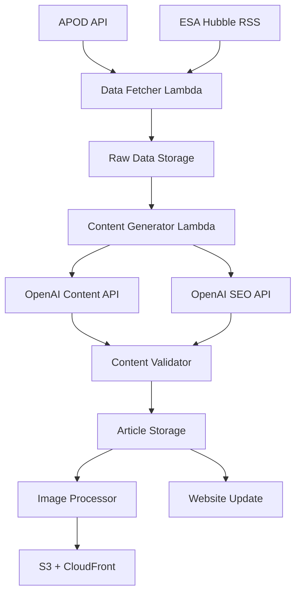

# Infinite v1.0 - Technical Specifications Document

**Version:** 1.0  
**Date:** January 7, 2025  
**Author:** Product Manager (PM Agent)  
**Status:** Ready for Architecture Phase  

---

## Table of Contents

1. [Executive Summary](#executive-summary)
2. [Project Overview](#project-overview)
3. [Technical Architecture](#technical-architecture)
4. [Database Schema Design](#database-schema-design)
5. [Content Pipeline Architecture](#content-pipeline-architecture)
6. [SEO Strategy Implementation](#seo-strategy-implementation)
7. [Monetization Integration](#monetization-integration)
8. [Performance Optimization](#performance-optimization)
9. [Monitoring & Alerting](#monitoring--alerting)
10. [Implementation Timeline](#implementation-timeline)
11. [Cost Analysis](#cost-analysis)
12. [Risk Assessment](#risk-assessment)

---

## Executive Summary

Infinite v1.0 is a Slovak astronomy content platform that automatically generates high-quality Slovak articles from NASA APOD and ESA Hubble content using OpenAI integration. The platform features comprehensive SEO optimization, automated content generation, and multiple monetization streams.

**Key Technical Requirements:**
- Serverless AWS architecture with Next.js frontend
- Automated content generation pipeline with OpenAI GPT-4o
- Optimized database schema for large-scale content storage
- Comprehensive SEO strategy for Slovak market
- Google Analytics, AdSense, and affiliate marketing integration
- Performance optimization for Core Web Vitals compliance

---

## Project Overview

### Business Objectives
- Launch Slovak astronomy content platform with 100+ articles
- Achieve strong SEO performance in Slovak market
- Generate revenue through Google AdSense and affiliate marketing
- Build scalable AWS infrastructure for content management
- Create engaging, educational content for Slovak astronomy enthusiasts

### Technical Stack
- **Frontend:** Next.js 15.5.4, React 19.1.0, TypeScript 5.6.x, Tailwind CSS 4.1.9
- **Backend:** AWS Lambda, API Gateway, DynamoDB, S3, CloudFront
- **AI Integration:** OpenAI GPT-4o for content and SEO generation
- **Analytics:** Google Analytics 4, Google AdSense
- **Deployment:** AWS Amplify, AWS MCP integration
- **Monitoring:** CloudWatch, custom metrics and alerting

### Content Sources
- **Daily:** NASA APOD API (`https://api.nasa.gov/planetary/apod?api_key=pQTZ1IYOmAqUfvaPcW11vQrNvEnFVlGmUFYbBcBx`)
- **Weekly:** ESA Hubble RSS (`https://feeds.feedburner.com/esahubble/images/potw/`)
- **Future:** Reddit and Wikipedia sources (planned for next releases)

---

## Technical Architecture

### AWS Infrastructure Overview

```yaml
Frontend:
  - AWS Amplify (Next.js hosting)
  - CloudFront CDN (global distribution)
  - Custom domain with SSL

Backend Services:
  - Lambda functions (content processing)
  - API Gateway (REST API)
  - DynamoDB (content storage)
  - S3 (image storage)
  - EventBridge (scheduling)

AI Integration:
  - OpenAI GPT-4o API
  - Content generation pipeline
  - SEO optimization pipeline

Monitoring:
  - CloudWatch (logs, metrics, alerts)
  - Custom dashboards
  - Performance monitoring
```

### Service Architecture

**Serverless Architecture with Event-Driven Processing:**



### IAM Roles and Permissions

**Required IAM Roles:**
- **Amplify Deployment Role:** Full access to Amplify, S3, CloudFront
- **Lambda Execution Role:** DynamoDB read/write, S3 access, EventBridge triggers
- **Content Pipeline Role:** OpenAI API access, image processing permissions
- **Analytics Role:** CloudWatch logs, metrics, and monitoring access

---

## Database Schema Design

### DynamoDB Tables

#### 1. RawContent Table
```yaml
TableName: RawContent
PartitionKey: source#date (String)
SortKey: timestamp (String)

Attributes:
  source_date: String          # "apod#2025-10-01"
  timestamp: String            # ISO timestamp
  source: String               # "apod" | "esahubble"
  date: String                 # "2025-10-01"
  original_id: String          # API ID or RSS GUID
  
  # APOD Specific Fields
  apod_data: Map
    - copyright: String
    - explanation: String
    - hdurl: String
    - url: String
    - media_type: String
    - service_version: String
    - title: String
  
  # ESA Hubble Specific Fields
  esahubble_data: Map
    - title: String
    - description: String
    - link: String
    - pubDate: String
    - guid: String
    - image_url: String
    - content_html: String
  
  # Processing Status
  processing_status: String    # "pending" | "processing" | "completed" | "failed"
  processed_at: String
  error_message: String
  
  # Images
  images: Map
    - original_url: String
    - hd_url: String
    - s3_key: String
    - s3_hd_key: String
    - processed: Boolean
    - formats: List
    - sizes: Map
  
  # Metadata
  created_at: String
  updated_at: String
  ttl: Number                 # 30 days
```

#### 2. Articles Table
```yaml
TableName: Articles
PartitionKey: category (String)
SortKey: slug (String)

Attributes:
  category: String            # "objav-dna" | "vysvetlenia" | "komunita" | "deti-a-vesmir"
  slug: String               # "motylia-hmlovina-objav-dna-7-oktober-2025"
  
  # Content
  title: String
  perex: String
  content: String
  word_count: Number
  
  # SEO Optimization (AI Generated)
  seo_meta: Map
    - meta_title: String     # "Motýlia hmlovina – Objav dňa 7. októbra 2025"
    - meta_description: String
    - keywords: List
    - structured_data: Map   # JSON-LD schema
    - internal_links: List
  
  # Content Structure (Following objav-dna-slovenstina.md)
  content_sections: Map
    - co_vidime: String      # "Čo vidíme na snímke"
    - preco_dolezite: String # "Prečo je tento objav dôležitý"
    - ako_vznikol: String    # "Ako záber vznikol"
    - zaujimavosti: List     # 3-5 interesting facts
    - faq: Map              # FAQ section
  
  # Images
  images: Map
    - primary_image: String
    - primary_alt: String
    - primary_title: String
    - secondary_image: String
    - secondary_alt: String
    - credits: String
  
  # Source Data Reference
  source_data: Map
    - source: String
    - source_date: String
    - raw_content_id: String
    - original_title: String
  
  # Publication
  publication_date: String
  status: String            # "draft" | "review" | "published" | "archived"
  author: String
  
  # Validation & Quality
  validation_status: Map
    - grammar_score: Number
    - seo_score: Number
    - content_score: Number
    - overall_score: Number
    - validation_errors: List
    - ready_for_publication: Boolean
  
  # Analytics
  analytics: Map
    - views: Number
    - engagement_time: Number
    - social_shares: Number
    - newsletter_clicks: Number
  
  # Metadata
  created_at: String
  updated_at: String
  ttl: Number              # Never expires (0)
```

#### 3. Global Secondary Indexes
```yaml
# RawContent GSI1: Date Index
GSI1Name: date-index
PartitionKey: date
SortKey: source#timestamp
ProjectionType: ALL

# RawContent GSI2: Status Index  
GSI2Name: status-index
PartitionKey: processing_status
SortKey: created_at
ProjectionType: ALL

# Articles GSI1: Publication Date Index
GSI1Name: publication-date-index
PartitionKey: publication_date
SortKey: category#slug
ProjectionType: ALL

# Articles GSI2: Status Index
GSI2Name: status-index
PartitionKey: status
SortKey: publication_date
ProjectionType: ALL

# Articles GSI3: Source Index
GSI3Name: source-index
PartitionKey: source_data.source
SortKey: publication_date
ProjectionType: ALL
```

---

## Content Pipeline Architecture

### Enhanced AI Prompts

#### 1. Content Generation Prompt
```javascript
const generateArticleContent = async (rawData) => {
  const enhancedPrompt = `
# ROLE: Expert Slovak Astronomy Content Writer

You are a professional Slovak astronomy writer with 10+ years of experience creating engaging, educational content for Slovak audiences.

# TASK: Create High-Quality Slovak Astronomy Article

## INPUT DATA:
${JSON.stringify(rawData, null, 2)}

## CONTENT REQUIREMENTS:

### 1. TITLE (H1)
- Create engaging, informative title WITHOUT date
- Use Slovak astronomy terminology
- Make it click-worthy but not clickbait
- Length: 50-70 characters

### 2. PEREX (Introduction)
- 1-2 sentences that hook the reader
- Answer "Why should I care about this?"
- Use dynamic, engaging language
- Length: 100-150 characters

### 3. CONTENT STRUCTURE (5 Required H2 Sections)
- "Čo vidíme na snímke" (What we see)
- "Prečo je tento objav dôležitý" (Why important)
- "Ako záber vznikol" (How created)
- "Zaujímavosti o objekte" (Interesting facts)
- "Často kladené otázky (FAQ)" (FAQ)

## WRITING GUIDELINES:
- Use proper Slovak grammar and syntax
- Include correct diacritics
- Write in natural, flowing Slovak
- Use active voice where possible
- Vary sentence length for readability

## OUTPUT FORMAT:
Return as JSON with exact structure specified...
`;

  const response = await openai.chat.completions.create({
    model: "gpt-4o",
    messages: [{ role: "user", content: enhancedPrompt }],
    temperature: 0.7,
    max_tokens: 3000
  });
  
  return JSON.parse(response.choices[0].message.content);
};
```

#### 2. SEO Generation Prompt
```javascript
const generateSEOContent = async (articleContent, rawData) => {
  const enhancedSEOPrompt = `
# ROLE: Expert Slovak SEO Specialist

You are a professional SEO specialist with deep expertise in Slovak language SEO optimization and astronomy content.

# TASK: Create Comprehensive SEO Optimization

## SEO REQUIREMENTS:

### 1. META TITLE
- Format: "[Object] – Objav dňa [date]"
- Length: 50-60 characters (strict limit)
- Include primary Slovak keyword

### 2. META DESCRIPTION
- Length: 140-155 characters (strict limit)
- Start with dynamic verb: "Pozrite sa", "Zistite", "Preskúmajte"
- Include key benefits and value proposition

### 3. STRUCTURED DATA (JSON-LD)
Create complete Article schema including all required fields.

### 4. SLOVAK KEYWORDS
- Primary Keywords (1-2)
- Secondary Keywords (3-5)
- Long-tail Keywords (2-3)

## OUTPUT FORMAT:
Return as JSON with exact structure specified...
`;

  const response = await openai.chat.completions.create({
    model: "gpt-4o",
    messages: [{ role: "user", content: enhancedSEOPrompt }],
    temperature: 0.3,
    max_tokens: 2000
  });
  
  return JSON.parse(response.choices[0].message.content);
};
```

### Pipeline Processing Flow

```javascript
// Content Generation Pipeline
const contentPipeline = {
  // 1. Data Fetching (EventBridge triggers)
  apodDaily: {
    schedule: "cron(0 5 * * ? *)", // 6:00 AM CET
    process: async () => {
      const apodData = await fetchAPODData();
      await storeRawContent(apodData);
      await triggerContentGeneration(apodData);
    }
  },
  
  esahubbleWeekly: {
    schedule: "cron(0 6 ? * MON *)", // Monday 7:00 AM CET
    process: async () => {
      const rssData = await fetchESAHubbleRSS();
      const content = parseRSSContent(rssData);
      await storeRawContent(content);
      await triggerContentGeneration(content);
    }
  },
  
  // 2. Content Generation
  generateContent: async (rawData) => {
    const [articleContent, seoContent] = await Promise.all([
      generateArticleContent(rawData),
      generateSEOContent(rawData)
    ]);
    
    const validation = await validateContent(articleContent, seoContent);
    
    if (validation.ready_for_publication) {
      await storeArticle({
        content: articleContent,
        seo: seoContent,
        validation: validation,
        status: "published"
      });
    }
  },
  
  // 3. Image Processing
  processImages: async (imageUrl, articleId) => {
    const originalImage = await downloadImage(imageUrl);
    const processedImages = await processImage(originalImage);
    const s3Urls = await uploadToS3(processedImages, articleId);
    return s3Urls;
  }
};
```

---

## SEO Strategy Implementation

### Slovak Market Keywords

```yaml
Primary Keywords:
  - "astronómia" (1,200 searches/month)
  - "vesmír" (2,100 searches/month)
  - "hviezdy" (800 searches/month)
  - "planéty" (600 searches/month)
  - "galaxie" (400 searches/month)

Long-tail Keywords:
  - "astronómia pre začiatočníkov" (150 searches/month)
  - "pozorovanie hviezd na Slovensku" (80 searches/month)
  - "teleskopy pre začiatočníkov" (120 searches/month)
  - "vesmírne objavy 2025" (200 searches/month)

Content-Specific Keywords:
  - "objav dňa" (300 searches/month)
  - "NASA snímky" (250 searches/month)
  - "Hubble teleskop" (180 searches/month)
  - "supernova" (150 searches/month)
```

### Technical SEO Implementation

```yaml
Meta Tags:
  - Dynamic meta titles (max 60 characters)
  - Meta descriptions (max 155 characters)
  - Open Graph tags for social media
  - Twitter Card optimization
  - Canonical URLs and proper URL structure

Structured Data:
  - Article schema markup (JSON-LD)
  - Organization schema for Infinite brand
  - BreadcrumbList schema for navigation
  - ImageObject schema for space images
  - FAQ schema for Q&A sections

Performance SEO:
  - Core Web Vitals optimization
  - Image optimization (WebP, responsive)
  - Code splitting and lazy loading
  - CDN optimization for global delivery
  - Mobile-first indexing compliance
```

---

## Monetization Integration

### Google Analytics 4 Configuration

```javascript
const ga4Config = {
  measurementId: 'G-XXXXXXXXXX',
  custom_dimensions: {
    'content_type': 'article_type',
    'astronomy_category': 'content_category',
    'user_engagement_level': 'engagement_tier',
    'content_source': 'apod_source'
  },
  
  trackingEvents: {
    articleView: {
      event_name: 'article_view',
      parameters: {
        article_id: 'string',
        article_title: 'string',
        category: 'string',
        source: 'string',
        word_count: 'number',
        reading_time: 'number'
      }
    },
    
    affiliateClick: {
      event_name: 'affiliate_click',
      parameters: {
        product_name: 'string',
        product_category: 'string',
        affiliate_network: 'string',
        article_context: 'string'
      }
    }
  }
};
```

### Google AdSense Integration

```yaml
Ad Placement Strategy:
  Header Banner:
    - Position: top
    - Size: 728x90
    - Type: display
    - Visibility: above_fold
    - Max ads per page: 1
  
  In-Article Ads:
    - Position: after_paragraph_2
    - Size: responsive
    - Type: display
    - Frequency: every_article
    - Context: astronomy_related
  
  Sidebar Ads:
    - Position: right_sidebar
    - Size: 300x250
    - Type: display
    - Pages: category, search, homepage
    - Max ads: 2
  
  Mobile Ads:
    - Position: between_content
    - Size: 320x50
    - Type: banner
    - Breakpoint: mobile_only
    - Frequency: controlled
```

### Affiliate Marketing (DogNet)

```yaml
Product Categories:
  Telescopes:
    - Beginner: Celestron PowerSeeker, Orion SkyQuest
    - Intermediate: Celestron NexStar, Meade LX85
    - Advanced: Celestron EdgeHD, Meade LX600
  
  Books:
    - Beginners: Astronomy for Dummies, Night Sky Guide
    - Advanced: Astrophysics Textbooks, Research Papers
  
  Accessories:
    - Filters: Light Pollution Filters, Moon Filters
    - Eyepieces: Wide Angle Eyepieces, Barlow Lenses
    - Mounts: Equatorial Mounts, Alt-Azimuth Mounts

Commission Rates:
  - Standard rate: 5-8%
  - Electronics: 3-5%
  - Books: 8-12%
  - Accessories: 6-10%
```

---

## Performance Optimization

### Core Web Vitals Targets

```yaml
Performance Metrics:
  Largest Contentful Paint (LCP):
    - Target: <2.5 seconds
    - Strategy: Optimize hero images, use WebP format
    - Implementation: CDN, image compression, lazy loading
  
  First Input Delay (FID):
    - Target: <100 milliseconds
    - Strategy: Minimize JavaScript, optimize third-party scripts
    - Implementation: Code splitting, async loading
  
  Cumulative Layout Shift (CLS):
    - Target: <0.1
    - Strategy: Reserve space for images, stable layouts
    - Implementation: Aspect ratio boxes, font loading optimization
```

### Image Optimization Pipeline

```javascript
const imageOptimization = {
  processing: {
    formats: ['webp', 'jpeg', 'avif'],
    sizes: [1200, 800, 400, 200],
    quality: 90,
    compression: 'lossless'
  },
  
  delivery: {
    cdn: 'CloudFront',
    caching: '30 days',
    compression: 'gzip',
    responsive: true
  },
  
  performance: {
    lazy_loading: true,
    placeholder: 'blur',
    priority: 'above_fold_only'
  }
};
```

---

## Monitoring & Alerting

### CloudWatch Metrics

```yaml
Application Metrics:
  - Lambda Duration, Errors, Throttles
  - DynamoDB Read/Write Capacity
  - API Gateway Latency, 4xx/5xx errors
  - S3 Request metrics

Custom Metrics:
  - Content generation success rate
  - OpenAI API response time
  - Image processing duration
  - SEO validation scores

Business Metrics:
  - Articles published per day
  - Content quality scores
  - SEO compliance rate
  - User engagement metrics
  - Revenue metrics
```

### Alerting Strategy

```yaml
Critical Alerts (P0):
  - Content generation failures
  - Database connection issues
  - API rate limit exceeded
  - Site availability <99%

Warning Alerts (P1):
  - High error rates (>5%)
  - Slow response times (>3s)
  - Low content quality scores
  - Revenue drops >20%

Info Alerts (P2):
  - New content published
  - High traffic spikes
  - SEO improvements
  - User engagement milestones
```

---

## Implementation Timeline

### Phase 1: Foundation (Weeks 1-2)
```yaml
Week 1:
  - AWS application creation and IAM setup
  - DynamoDB schema implementation
  - S3 storage and CloudFront configuration
  - Basic Lambda functions setup
  
Week 2:
  - AWS Amplify hosting setup
  - API Gateway configuration
  - EventBridge scheduling
  - Basic monitoring setup
```

### Phase 2: Content Pipeline (Weeks 3-4)
```yaml
Week 3:
  - APOD API integration
  - ESA Hubble RSS integration
  - OpenAI content generation
  - Image processing pipeline
  
Week 4:
  - Content validation system
  - SEO optimization pipeline
  - Quality scoring system
  - Error handling and retry logic
```

### Phase 3: Frontend Enhancement (Weeks 5-6)
```yaml
Week 5:
  - Search functionality implementation
  - SEO optimization and meta tags
  - Performance optimization
  - Core Web Vitals compliance
  
Week 6:
  - Content display enhancement
  - Newsletter integration
  - User engagement features
  - Mobile optimization
```

### Phase 4: Monetization (Weeks 7-8)
```yaml
Week 7:
  - Google Analytics 4 integration
  - Google AdSense setup
  - Affiliate marketing integration
  - Revenue tracking implementation
  
Week 8:
  - Performance optimization
  - A/B testing setup
  - Revenue reporting dashboard
  - Final testing and deployment
```

---

## Cost Analysis

### AWS Infrastructure Costs (Monthly)

```yaml
Lambda Functions:
  - Compute: $5-15/month
  - Requests: $2-5/month
  - Total: $7-20/month

DynamoDB:
  - Storage: $0.25/month (1GB)
  - Read/Write: $1-3/month
  - Total: $1.25-3.25/month

S3 Storage:
  - Storage: $0.50/month (10GB)
  - Requests: $0.50/month
  - Total: $1/month

CloudFront:
  - Data transfer: $2-5/month
  - Requests: $0.50/month
  - Total: $2.50-5.50/month

Amplify:
  - Hosting: $1/month
  - Build minutes: $2-5/month
  - Total: $3-6/month

Total AWS Costs: $14.75-35.75/month
```

### External Service Costs

```yaml
OpenAI API:
  - Content generation: $0.03/article
  - SEO optimization: $0.015/article
  - Total per article: $0.045
  - Monthly (30 articles): $1.35

Google Analytics: Free
Google AdSense: Free (revenue sharing)
DogNet Affiliate: Free (commission based)

Total External Costs: $1.35/month
```

### Total Monthly Operating Costs: $16-37/month

---

## Risk Assessment

### Technical Risks

```yaml
High Risk:
  - OpenAI API rate limits or service outages
  - AWS service integration complexity
  - Content generation quality consistency
  
Medium Risk:
  - Database performance at scale
  - Image processing bottlenecks
  - SEO optimization effectiveness
  
Low Risk:
  - Frontend performance issues
  - Monitoring and alerting gaps
  - Cost optimization needs
```

### Mitigation Strategies

```yaml
OpenAI API Risks:
  - Implement retry logic with exponential backoff
  - Cache responses for similar content
  - Fallback to template-based content generation
  - Monitor usage and implement rate limiting

AWS Integration Risks:
  - Use Infrastructure as Code (CDK/CloudFormation)
  - Implement comprehensive error handling
  - Set up monitoring and alerting from day one
  - Plan for service limits and scaling

Content Quality Risks:
  - Implement comprehensive validation system
  - Use enhanced prompts with detailed instructions
  - Set up manual review queue for low-quality content
  - Continuous prompt optimization based on results
```

---

## Success Metrics

### Technical KPIs

```yaml
Performance:
  - Page load time: <3 seconds
  - Core Web Vitals: >90 score
  - Uptime: >99.9%
  - Error rate: <1%

Content Pipeline:
  - Content generation success rate: >95%
  - Average processing time: <2 minutes
  - Content quality score: >80
  - SEO compliance rate: >90%
```

### Business KPIs

```yaml
Content:
  - Articles published: 30/month
  - Content quality: >80/100
  - User engagement: >2 minutes average
  - Newsletter signups: 100/month

Revenue:
  - Monthly revenue: $200-800
  - Revenue per visitor: $0.05-0.20
  - Affiliate conversion rate: >5%
  - AdSense RPM: >$2
```

---

## Conclusion

This technical specification provides a comprehensive foundation for implementing Infinite v1.0, a Slovak astronomy content platform with automated content generation, SEO optimization, and monetization capabilities. The architecture is designed for scalability, performance, and cost-effectiveness while maintaining high content quality and user experience.

The implementation should follow the phased approach outlined in the timeline, with careful attention to the risk mitigation strategies and success metrics defined in this document.

---

**Document Status:** Ready for Architecture Phase  
**Next Steps:** Hand off to Architect for detailed technical design and implementation planning  
**Estimated Implementation Time:** 8 weeks  
**Total Project Budget:** $200-400/month operating costs
